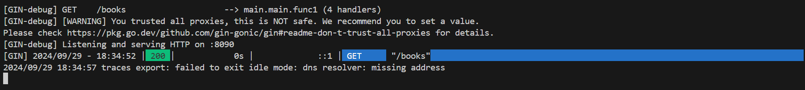

Este repositório contém um projeto de exemplo que implementa OpenTelemetry com SigNoz em uma aplicação Go utilizando o framework Gin.

## Como Executar

1. Clone o repositório:
   ```bash
   git clone https://github.com/renanribeir0/ponderadase8.git
   cd ponderadase8

1. **Execução do servidor Go:**
   - Execução da aplicação Go.

   

2. **Resposta JSON:**
   - Resposta JSON recebida ao fazer a requisição.

   

   

   

3. **Dashboard do SigNoz:**
   - Após configurar e iniciar o SigNoz, capture um print do dashboard mostrando os dados coletados.

   
